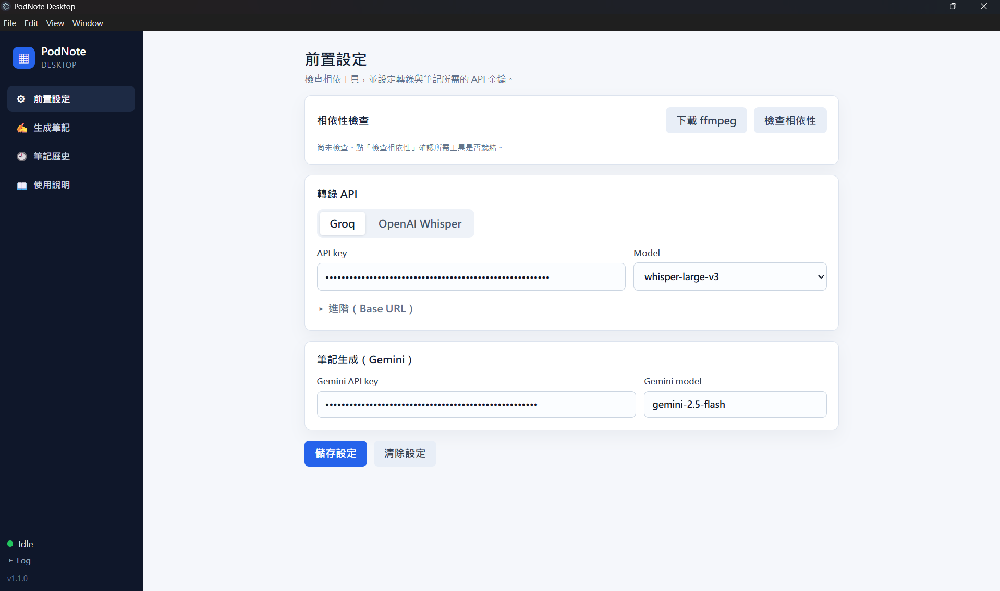
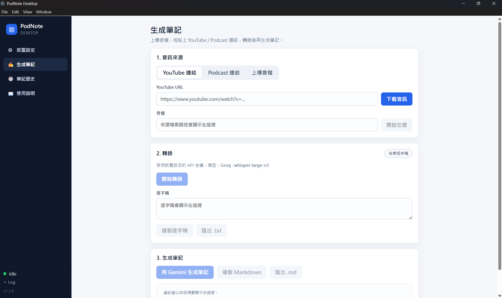
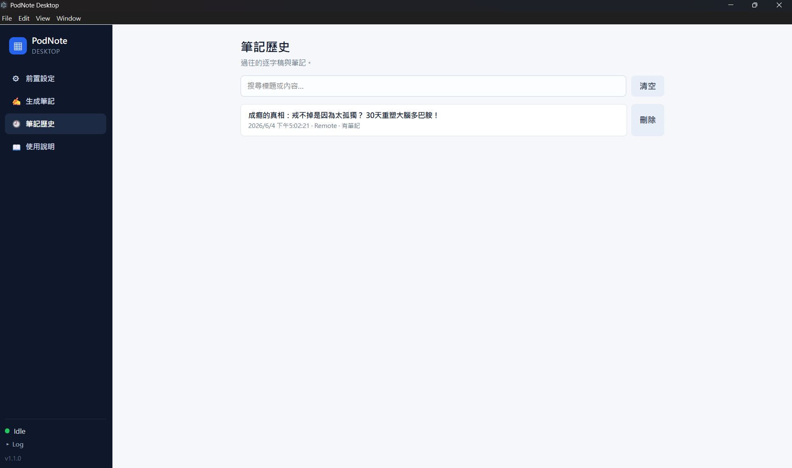
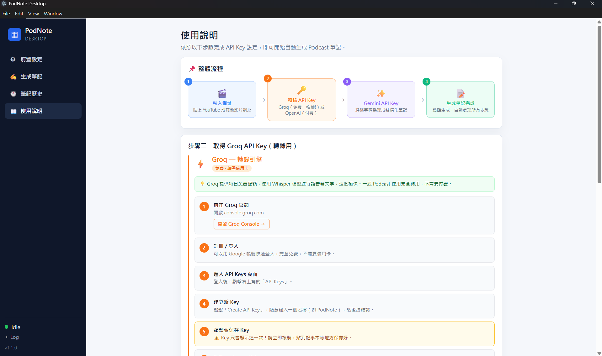

# PodNote

把 Podcast / YouTube 內容轉成逐字稿，再用 Gemini 整理成結構化筆記。

## 兩種版本（Web / 桌面）

PodNote 提供 **Web 版** 與 **桌面版**，功能與金鑰需求不同：

| | Web 版 | 桌面版 |
|---|---|---|
| **平台** | Web + Android | Windows 桌面 |
| **音訊來源** | Podcast | YouTube / Podcast / 上傳音檔 |
| **轉錄** | 後端 faster-whisper 代勞（伺服器跑）<br>或外接 Groq（較快） | 雲端 Whisper API（Groq / OpenAI）|
| **筆記** | Gemini | Gemini |
| **金鑰需求** | Gemini（必填）<br>Groq（選填，用快速轉錄時） | Groq 或 OpenAI（必填）<br>＋ Gemini（必填）|
| **安裝** | 免安裝，直接開線上版 → https://frankkn-podnote-api.hf.space | 下載 [installer.exe](https://github.com/frankkn/PodNote/releases) 安裝（Windows）|

## 桌面版畫面截圖









## 立即打開 Web App

最快方式：不用安裝，直接開已部署的線上版。

```text
https://frankkn-podnote-api.hf.space
```

第一次開 Hugging Face Space 可能會等幾秒喚醒服務。打開 App 後，到設定頁輸入自己的 Gemini API Key（整理筆記用）；若要用「快速」轉錄，再加上自己的 Groq API Key。設定完就可以貼 Podcast 連結產生筆記。

轉錄有兩種模式：

- **快速（推薦）**：用外部 GPU（Groq Whisper API）轉錄，又快又準。需要在設定頁輸入自己的 Groq API Key 跟 Gemini API Key（參考下方申請 API Key 流程，非常簡單！）。金鑰存在本機，產生筆記時才傳到後端呼叫 Groq，用完即丟、不會保存。
- **慢速（簡單）**：用伺服器 CPU 轉錄，只需要申請 Gemini API Key，但速度較慢、有長度與併發限制。

服務狀態檢查：

```text
https://frankkn-podnote-api.hf.space/health
```

## 立即使用桌面版 App

桌面版是獨立的 **Windows 應用程式**，不需要自己架後端，下載安裝就能用。內建 yt-dlp 並會自動取得 ffmpeg，可直接處理 **YouTube / Podcast 連結或本機音檔**，轉錄走雲端 Whisper（Groq 或 OpenAI），筆記用 Gemini。

### 下載與安裝

1. 開啟 [GitHub Releases 頁面](https://github.com/frankkn/PodNote/releases)。
2. 在最新版本（標記 **Latest**）的 **Assets** 區，下載安裝檔 `PodNote-Setup-X.Y.Z.exe`。
3. 雙擊執行安裝檔。若 Windows SmartScreen 跳出「**Windows 已保護您的電腦**」，點「**其他資訊**」→「**仍要執行**」即可（未簽章應用程式的正常提示）。
4. 安裝完成後，從開始選單或桌面捷徑開啟 **PodNote**。

### 首次設定

開啟 App 後，到**設定頁**輸入金鑰（申請方式見下方「[申請 API Key](#申請-api-key)」）：

- **Gemini API Key**（整理筆記用，必填）
- **Groq 或 OpenAI API Key**（雲端 Whisper 轉錄用，必填；兩者擇一，都填時優先用 OpenAI）

金鑰存在本機，產生筆記時才隨請求送出呼叫 API，用完即丟、不會保存。

### 開始使用

回到主畫面，貼上 **YouTube / Podcast 連結**或選擇**本機音檔**，按下開始即可自動下載音訊、轉錄逐字稿，並用 Gemini 整理成結構化筆記。

> **自動更新**：桌面版內建 electron-updater，啟動時會自動檢查 GitHub Releases 是否有新版，有的話會在背景下載並提示更新。

## 申請 API Key

### Gemini API Key（必要）

用於把逐字稿整理成筆記，免費額度通常足夠個人使用。

1. 開啟 [https://aistudio.google.com](https://aistudio.google.com)，用 Google 帳號登入。
2. 左側選單點「**Get API key**」。
3. 點「**Create API key**」→ 選擇一個 Google Cloud 專案（或讓它自動建立）→ 點「建立 API 金鑰」。
4. 複製畫面上顯示的金鑰（以 `AIza` 開頭）。
5. 到 App 的**設定頁**，把金鑰貼入「Gemini API Key」欄位，按儲存。

> 若遇到 429 配額錯誤，通常是該 key 對特定模型的免費額度用完。可到 [aistudio.google.com](https://aistudio.google.com) 用新的 Google 專案重建一把 key。

---

### Groq API Key（快速模式用，選填）

只有選「快速（推薦）」轉錄模式才需要。目前免費、不需綁信用卡。

1. 開啟 [https://console.groq.com](https://console.groq.com)，用 Google 帳號或 email 登入／註冊。
2. 右上角選單點「**API Keys**」。
3. 點「**Create API Key**」，取個名字（例如 `podnote`），按建立。
4. 複製畫面上顯示的金鑰（以 `gsk_` 開頭）。**此金鑰只會顯示一次**，請立即複製。
5. 到 App 的**設定頁**，把金鑰貼入「Groq API Key」欄位，按儲存。

> 沒有 Groq Key 也沒關係，改選「慢速（簡單）」模式即可使用，不需任何額外設定。

---

## 專案結構

```text
PodNote/
  backend/   FastAPI API、轉錄工作、已匯出的 Web 靜態檔（web 版部署到 HF Space）
  frontend/  Expo / React Native Web 前端原始碼（web 版畫面）
  desktop/   Electron 桌面應用程式原始碼（Windows，獨立打包、不依賴後端）
```

## 版本記錄

### 網頁版

| 版本 | 日期 | 重點 |
|------|------|------|
| v1.4.0 | 2026-06-04 | 新增使用說明頁；後端支援 OpenAI Whisper 轉錄（與 Groq 二擇一） |
| v1.3.1 | 2026-06-01 | 設定頁顯示目前版本；版本資訊集中管理（`app.json` 為單一來源）；重新匯出部署靜態檔 |
| v1.3.0 | 2026-06-01 | 轉錄完成後在背景自動以 Gemini 生成摘要；中文固定繁體輸出（OpenCC `s2tw`）；摘要流程移到模組層級更穩定 |
| v1.2.0 | 2026-06-01 | 修復網頁版桌面佈局白畫面（emoji 取代 vector-icons、Sidebar 改用 `router.push`、卡片 flex 撐滿）；新增 Playwright 測試 |
| v1.1.0 | 2026-06-01 | 寬螢幕（≥768px）雙欄 Sidebar 佈局；筆記 Markdown 渲染；長節目分段（每段 5 分鐘）轉檔；防濫用與音訊長度上限 |
| v1.0.0 | 2026-06-01 | 首個正式版：Podcast 連結 → 轉錄 → Gemini 筆記；雙模式轉錄（Groq 快速 / CPU 慢速）；多集併發、筆記歷史；部署於 Hugging Face Spaces |

### 桌面版

| 版本 | 日期 | 重點 |
|------|------|------|
| v1.2.0 | 2026-06-09 | 改用 GitHub Actions（windows runner）自動打包發版；web / desktop 以 tag prefix 分流互不干擾；安裝檔名固定為 `PodNote-Setup-<version>.exe` |
| v0.2.0 | 2026-06-04 | 下載按鈕與網址輸入框同列；逐字稿框縮為 2 行；設定頁標示轉錄 API Key 為必填 |
| v0.1.1 | 2026-06-04 | 首個獨立 Windows 桌面版：免後端、打包為安裝檔；內建 yt-dlp、首次執行自動取得 ffmpeg；Sidebar 三欄式佈局；Gemini 筆記生成；GitHub 自動更新（electron-updater） |
